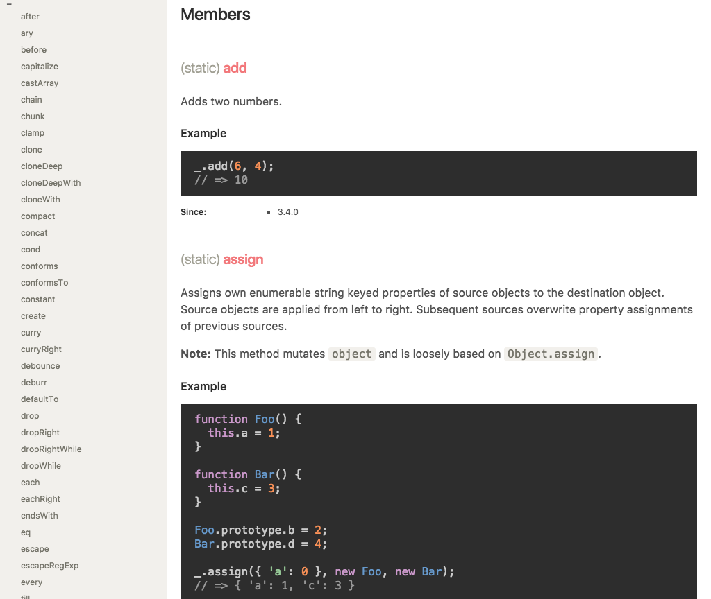

Raygun
======

A clean, responsive documentation template theme for JSDoc 3. Based on [Minami](https://github.com/Nijikokun/minami).

NPM
---

```bash
npm install --save-dev samme/raygun
```

In your project's `package.json`, add to `scripts`:

```json
"scripts": {
  "docs": "jsdoc --configure jsdoc-conf.json"
}
```

Create a `jsdoc-conf.json` file and add `opts.template`:

```json
"opts": {
  "template": "node_modules/raygun"
}
```

(See [Configuring JSDoc with conf.json](http://usejsdoc.org/about-configuring-jsdoc.html); [Example config file](https://github.com/jsdoc3/jsdoc/blob/master/conf.json.EXAMPLE).)

Then

```bash
npm run docs
```

Non-NPM
-------

Clone repository to your designated `jsdoc` template directory, then:

```bash
jsdoc entry-file.js -t path/to/raygun
```

(See [Command-line arguments to JSDoc](http://usejsdoc.org/about-commandline.html).)

Thanks :heart:
------

- [Nijikokun/minami](https://github.com/Nijikokun/minami)
- [chriskempson/tomorrow-theme](https://github.com/chriskempson/tomorrow-theme)
- [jmblog/color-themes-for-google-code-prettify](https://github.com/jmblog/color-themes-for-google-code-prettify)

License
-------

Licensed under the Apache2 license.
